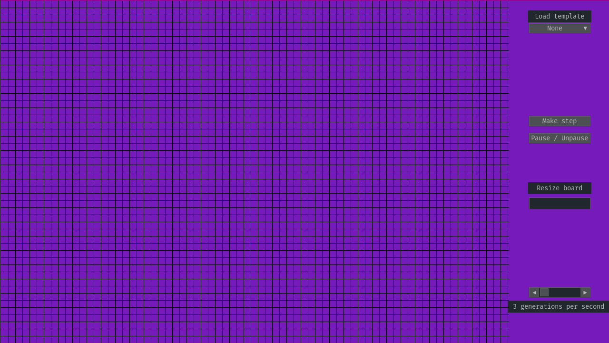
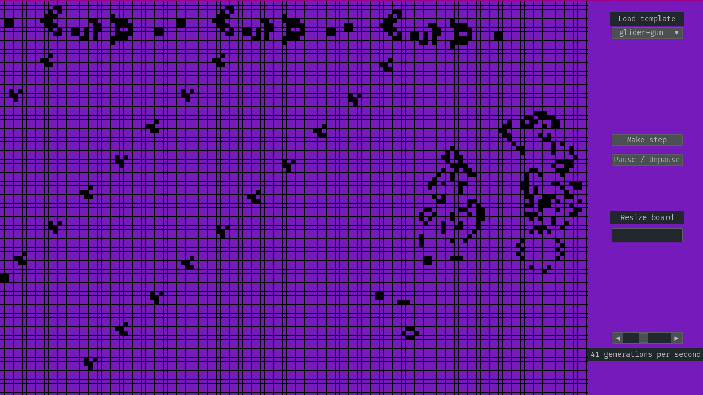

# Game-of-life
Conway's game of life implementation with optimizations and some fancy UI.

## Requirements
 - Python 3.5+
 - Pygame
 - [Pygame-gui](https://github.com/MyreMylar/pygame_gui)

## How to install
Clone the repository and execute "game_of_life.py"

## How to use
 - Draw or erase cells with LMB
 - Pause / Unpause with spacebar or button
 - Load templates from .txt files
 - Change number of cells with Resize button
 - Change simulation speed with slider

## Screenshots

